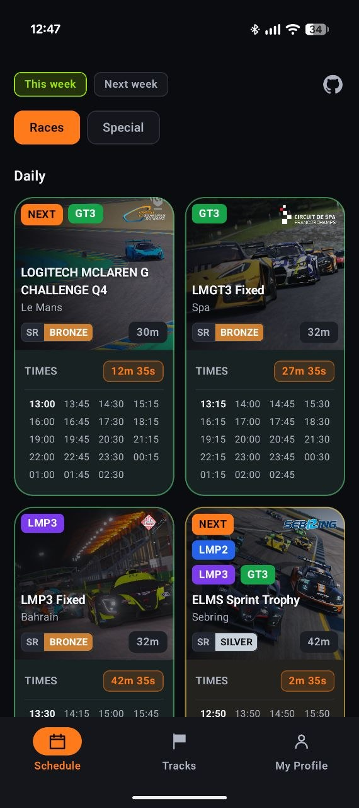
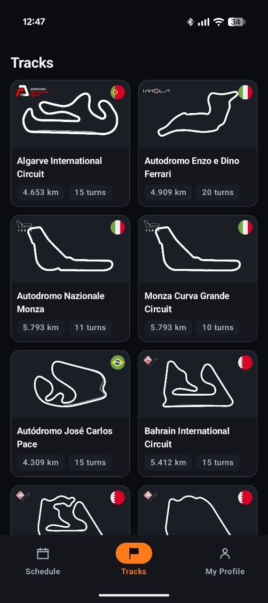
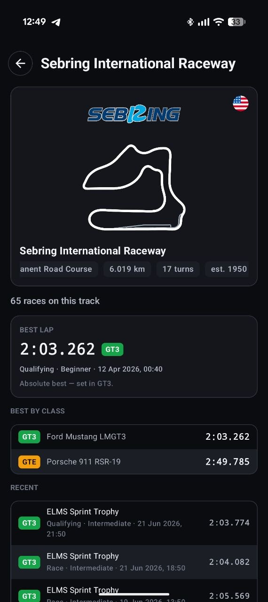
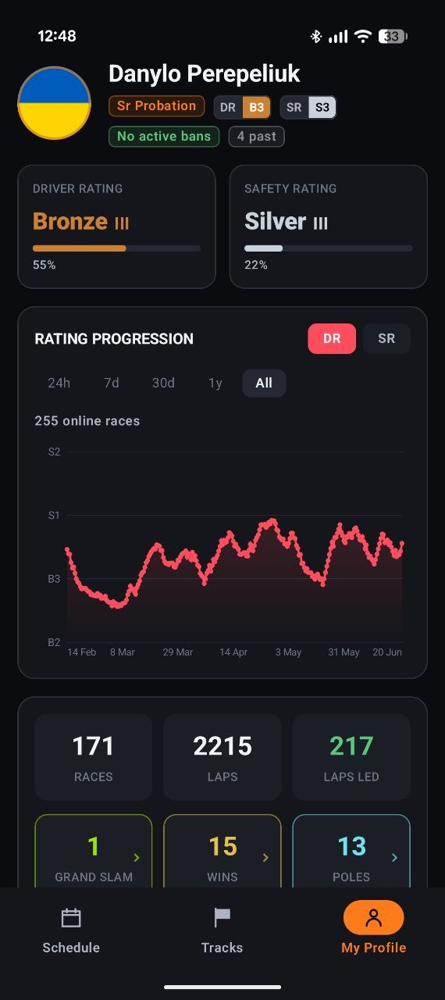
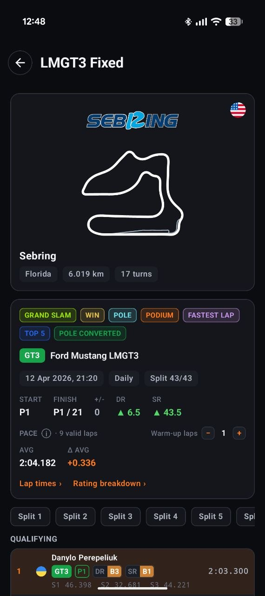

<div align="center">

# 🏁 LMU Assister

**A companion app for [Le Mans Ultimate](https://www.lemansultimate.com/) — schedule, tracks, public driver profiles, leaderboards and your own driver profile, on every platform from one Kotlin codebase.**

[](https://kotlinlang.org)
[](https://www.jetbrains.com/compose-multiplatform/)
[](#-platforms)
[](#-running-the-apps)
[](https://ktor.io)
[](https://insert-koin.io)

</div>

---

## 📸 Screenshots

<div align="center">

<table>
<tr>
<td align="center" width="20%"><br><sub><b>Schedule</b></sub></td>
<td align="center" width="20%"><br><sub><b>Tracks</b></sub></td>
<td align="center" width="20%"><br><sub><b>Track detail</b></sub></td>
<td align="center" width="20%"><br><sub><b>Profile</b></sub></td>
<td align="center" width="20%"><br><sub><b>Your race result</b></sub></td>
</tr>
</table>

</div>

---

## ✨ Features

- **📅 Schedule** — daily / weekly / special / championship races with a collapsing week-and-category header, per-class colours, countdowns and pull-to-refresh.
- **🗺️ Tracks** — official track roster with cached public details, circuit emblems, minimaps and personal/public stats drill-downs.
- **🏎️ Race details** — circuit emblem, minimap, weather, settings, and the official fastest-lap **leaderboards** split per class (with your own row pinned via *"Your position"*).
- **🥇 Full leaderboard** — cursor-paginated (Paging 3), infinite scroll, aggressive prefetch.
- **👥 Public drivers** — searchable driver directory with rating distributions, top safety drivers, public profiles, race history and track breakdowns.
- **👤 Steam profile** — sign in with your Steam account to see your Driver/Safety rating, rating progression, favourite cars, badges, suspensions and recent races (offline-first, optimistic UI).
- **📜 Race history** — paginated "See all races", plus a per-race **detail page** with track card, your start→finish + positions gained/lost, and full qualifying/race classification (windowed around you, expandable, with player flags).
- **🌑 Dark motorsport theme** throughout, with a custom vector icon set and a small Material icon fallback for platform-standard actions.

## 📱 Platforms

| Target | Status | Steam auth |
| --- | --- | --- |
| **Android** | ✅ | On-device (JavaSteam) |
| **Desktop (JVM)** | ✅ | On-device (JavaSteam) |
| **iOS** | ✅ | On-device (kSteam) |
<!-- TUNNEL_DISABLED:
| **iOS** | ✅ | Backend + device tunnel |
-->

> **Android, iOS & Desktop** sign in to Steam **on-device** with kSteam/JavaSteam-style SteamKit support: your credentials never leave the machine — only a short-lived Steam Web API ticket is sent to the backend, which exchanges it for a game-data session. Session tokens are persisted securely per platform (Android `EncryptedSharedPreferences`, iOS **Keychain**, JVM a local file).
<!-- TUNNEL_DISABLED:
> **Android & Desktop** sign in to Steam **on-device** with JavaSteam (a SteamKit2 port): your credentials never leave the machine — only a short-lived Steam Web API ticket is sent to the backend, which exchanges it for a game-data session. **iOS** has no native Steam library, so credentials go to the backend sidecar (.NET SteamKit2); but the Steam connection itself is routed back out through the device over a SOCKS-over-WebSocket tunnel, so Steam sees your normal home IP. Session tokens are persisted securely per platform (Android `EncryptedSharedPreferences`, iOS **Keychain**, JVM a local file).
-->

## 🔐 Security & privacy

- **Android, iOS & Desktop — credentials never leave your device.** kSteam performs the whole Steam login locally; only a short-lived Steam Web API ticket is sent to the backend (exchanged for a game-data session). Your password and 2FA code never touch the network beyond Steam itself.
<!-- TUNNEL_DISABLED:
- **Android & Desktop — credentials never leave your device.** JavaSteam performs the whole Steam login locally; only a short-lived Steam Web API ticket is sent to the backend (exchanged for a game-data session). Your password and 2FA code never touch the network beyond Steam itself.
- **iOS — credentials are used once, server-side, and never kept.** They go to the backend sidecar (.NET SteamKit2) over HTTPS, are used in memory to sign in, then discarded immediately — not stored, not logged, not shared. The login egresses through your device (tunnel), so Steam sees your home IP.
-->
- **Steam refresh tokens stay on your device, encrypted** (Android `EncryptedSharedPreferences`, iOS Keychain, JVM a local file). The backend stores only game-backend session tokens tied to your game-account id — never your Steam password or 2FA.
- **No ads.** Public content (schedule, tracks, public drivers, leaderboards) is read through a shared service account, so browsing needs no sign-in; only your own data (profile, ratings, history, your leaderboard row) requires it.
- The full policy is fetched live and rendered in-app (`GET /api/v2/privacy`), linked from the sign-in screen.
- **Telemetry is platform-scoped.** Android and iOS wire common analytics/non-fatal events into Firebase Analytics + Crashlytics; Desktop leaves telemetry as a no-op.

## 🧱 Tech stack

| Concern | Library |
| --- | --- |
| UI | Compose Multiplatform 1.11.1 |
| Navigation | `navigation-compose` 2.9.2 (type-safe routes) |
| Networking | Ktor 3.5.1 (OkHttp / Darwin / CIO engines) |
| Serialization | `kotlinx.serialization` 1.11.0 (snake_case ↔ camelCase) |
| DI | Koin 4.2.2 |
| Images | Coil 3.5.0 (+ SVG) |
| Pagination | AndroidX Paging 3.5.0 (multiplatform) |
| Secure storage | `androidx.security.crypto` / iOS Keychain |
| Telemetry | Firebase Analytics + Crashlytics on Android/iOS; no-op on Desktop |

## 🚀 Running the apps

### 1. Configure the backend (optional — mock data by default)

**You can run the app with zero setup.** With no `local.properties`, the app boots a
built-in **mock backend**: a Ktor `MockEngine` serves deterministic, seeded data for
every screen (schedule, tracks, public drivers, race details, leaderboards, cars,
and a fully signed-in profile — no Steam login needed), with simulated loading. Great for UI work and for
contributors without backend access — the real host is never disclosed.

To point at a real backend instead, set its base URL in `local.properties`
(git-ignored, never committed):

```properties
backend.url=https://your-backend.example.com/api/v2
```

Toggles:

- `backend.url` **set** → real backend (mock off).
- `backend.url` **unset** → mock on (falls back to `http://localhost:8000/api/v2` for the URL, but no network is hit).
- `backend.mock=true|false` → force mock on/off regardless of `backend.url` (e.g. run the real URL but with mock data, or vice-versa).
- `demo.username` / `demo.password` → optional app-review/demo login credentials for `/auth/demo`; leave unset for normal Steam auth.

### 2. Run

| Platform | Command |
| --- | --- |
| **Android** | `./gradlew :androidApp:assembleDebug` (or run from the IDE) |
| **Desktop** | `./gradlew :desktopApp:run` — hot reload: `./gradlew :desktopApp:hotRun --auto` |
| **iOS** | open `iosApp/` in Xcode and run, or use the KMP run configuration |

## ⚙️ Requirements

- JDK 21
- Android SDK (compileSdk 37, minSdk 24)
- Xcode (for the iOS target)
- Firebase config files for production telemetry builds (`androidApp/google-services.json`, iOS `GoogleService-Info.plist`)

---

<div align="center">
<sub>Built with ❤️ and Kotlin Multiplatform · not affiliated with Studio 397 / Motorsport Games.</sub>
</div>
