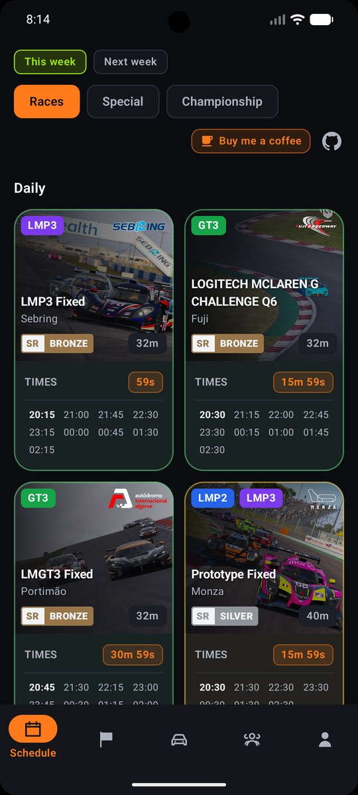
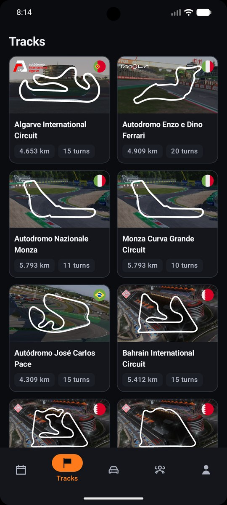
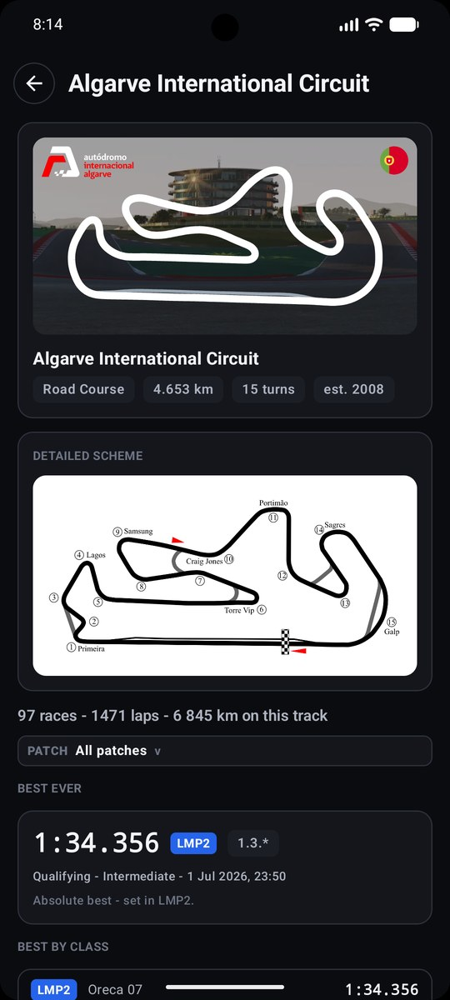
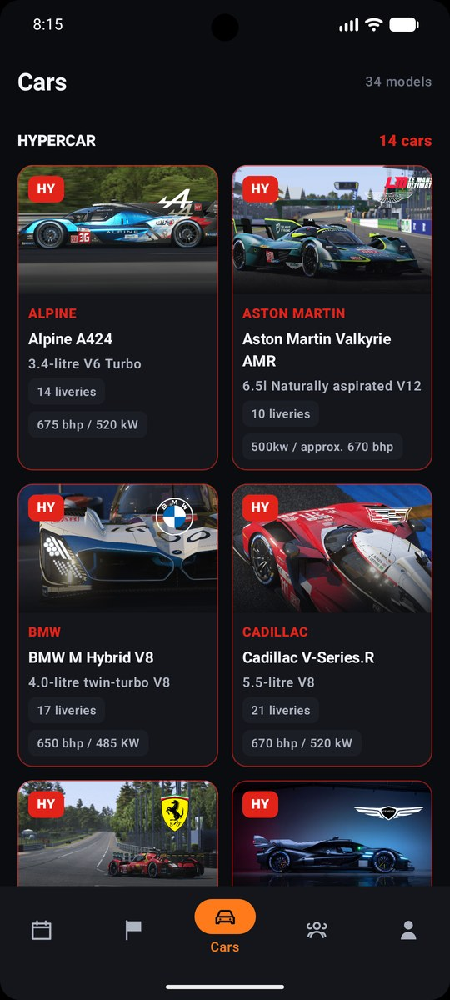
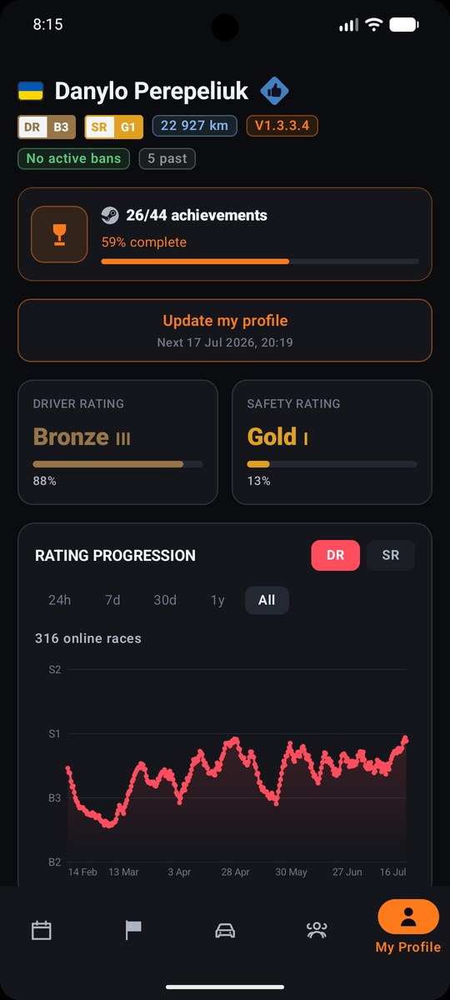
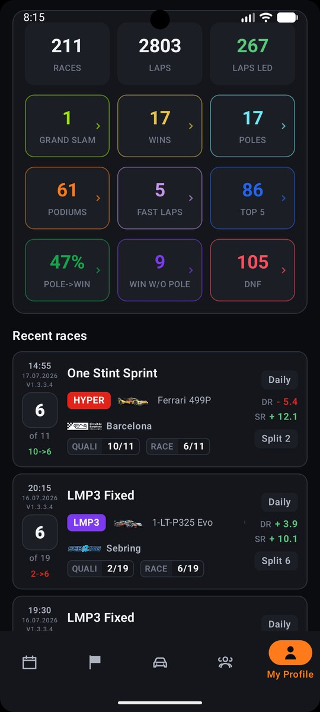
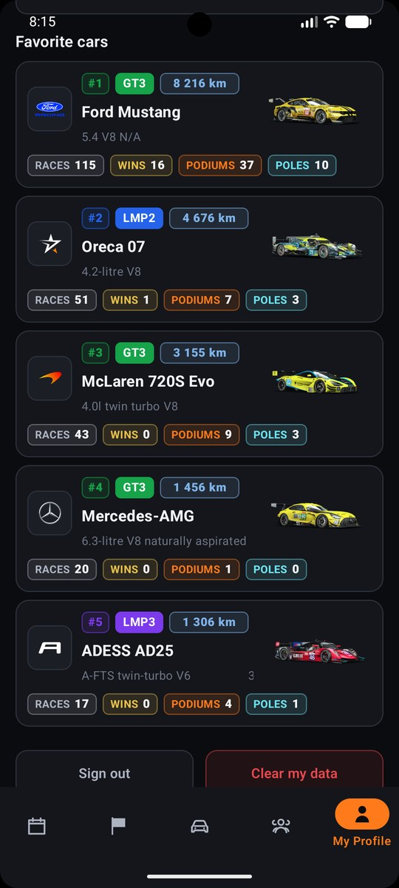
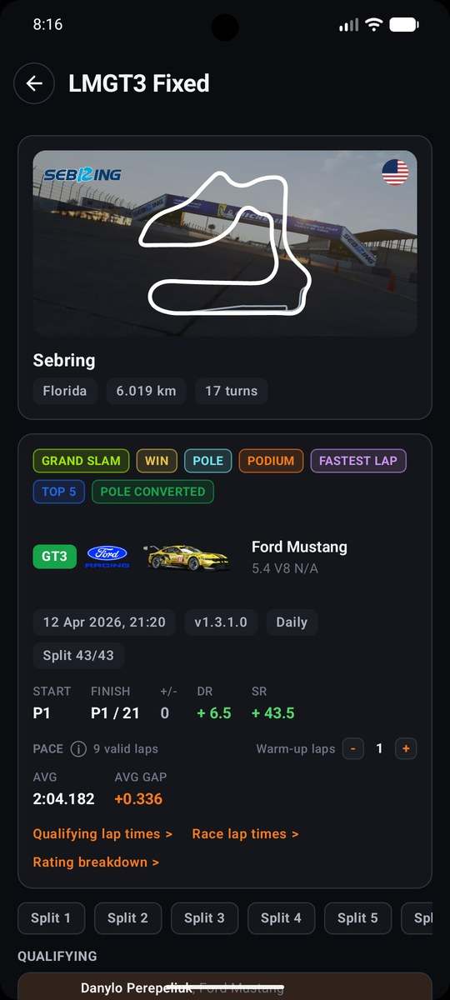
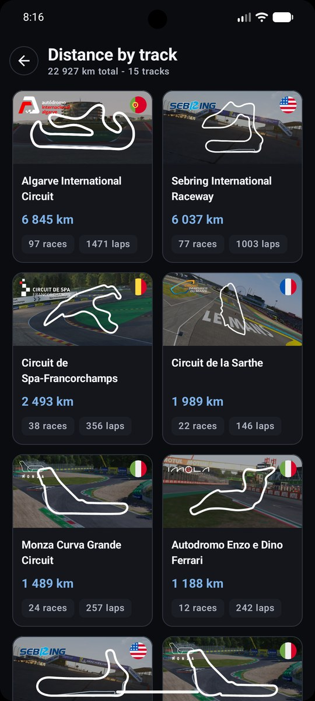

<div align="center">

# 🏁 LMU Assister

**A companion app for [Le Mans Ultimate](https://www.lemansultimate.com/) — schedule, tracks, public driver profiles, leaderboards and your own driver profile on Android, iOS, Desktop and Web from one Kotlin codebase.**

[](https://kotlinlang.org)
[](https://www.jetbrains.com/compose-multiplatform/)
[](#-platforms)
[](#-running-the-apps)
[](https://ktor.io)
[](https://insert-koin.io)

</div>

---

## 🌐 Web Steam Sign-In Helper

LMU Assister Web runs in the browser, so it cannot talk to Steam directly. Steam
sign-in is delegated to a tiny local JVM minter that runs on `127.0.0.1:8787`,
mints a short-lived Steam ticket locally, and sends only that ticket to the
backend. The helper is installed per-user, starts on login, and ships with its
own runtime, so Java does not need to be installed separately.

On first web sign-in, the browser may ask for permission to access apps and
services on this device. LMU Assister uses that permission only to reach the
local minter.

macOS / Linux:

```bash
curl -fsSL https://raw.githubusercontent.com/orioneee/LMU-Assister/main/install/minter/install.sh | sh
```

Windows PowerShell:

```powershell
irm https://raw.githubusercontent.com/orioneee/LMU-Assister/main/install/minter/install.ps1 | iex
```

Installer sources: [install.sh](install/minter/install.sh) and
[install.ps1](install/minter/install.ps1). Health check:
`http://127.0.0.1:8787/health`.

Uninstall macOS:

```bash
launchctl unload -w "$HOME/Library/LaunchAgents/com.lmu-assister.minter.plist" 2>/dev/null || true
rm -f "$HOME/Library/LaunchAgents/com.lmu-assister.minter.plist"
rm -rf "$HOME/Library/Application Support/LMU Assister/Minter"
```

Uninstall Linux:

```bash
systemctl --user disable --now lmu-minter.service 2>/dev/null || true
rm -f "${XDG_CONFIG_HOME:-$HOME/.config}/systemd/user/lmu-minter.service"
systemctl --user daemon-reload 2>/dev/null || true
rm -f "${XDG_CONFIG_HOME:-$HOME/.config}/autostart/lmu-minter.desktop"
pkill -f 'lmu-assister/minter/bin/lmu-minter' 2>/dev/null || true
rm -rf "${XDG_DATA_HOME:-$HOME/.local/share}/lmu-assister/minter"
```

Uninstall Windows PowerShell:

```powershell
Stop-ScheduledTask -TaskName "LMU Assister Minter" -ErrorAction SilentlyContinue
Unregister-ScheduledTask -TaskName "LMU Assister Minter" -Confirm:$false -ErrorAction SilentlyContinue
Remove-Item "$env:LOCALAPPDATA\LMU Assister\Minter" -Recurse -Force -ErrorAction SilentlyContinue
```

If you installed with a custom `LMU_MINTER_HOME`, remove that directory instead
of the default install path.

---

## 📸 Screenshots

<div align="center">

<table>
<tr>
<td align="center" width="33%"><br><sub><b>Schedule</b></sub></td>
<td align="center" width="33%"><br><sub><b>Tracks</b></sub></td>
<td align="center" width="33%"><br><sub><b>Track detail</b></sub></td>
</tr>
<tr>
<td align="center" width="33%"><br><sub><b>Cars</b></sub></td>
<td align="center" width="33%"><br><sub><b>Profile</b></sub></td>
<td align="center" width="33%"><br><sub><b>Driver stats</b></sub></td>
</tr>
<tr>
<td align="center" width="33%"><br><sub><b>Favorite cars</b></sub></td>
<td align="center" width="33%"><br><sub><b>Your race result</b></sub></td>
<td align="center" width="33%"><br><sub><b>Track breakdown</b></sub></td>
</tr>
</table>

</div>

---

## ✨ Features

- **📅 Schedule** — daily / weekly / special / championship races with a collapsing week-and-category header, per-class colours, countdowns and pull-to-refresh.
- **🗺️ Tracks** — official track roster with cached public details, circuit emblems, minimaps and personal/public stats drill-downs.
- **🏎️ Race details** — circuit emblem, minimap, weather, settings, and the official fastest-lap **leaderboards** split per class (with your own row pinned via *"Your position"*).
- **🥇 Full leaderboard** — cursor-paginated (Paging 3), infinite scroll, aggressive prefetch.
- **👥 Public drivers** — searchable driver directory with rating distributions, top safety drivers, public profiles, race history and track breakdowns.
- **👤 Steam profile** — sign in with your Steam account to see your Driver/Safety rating, rating progression, favourite cars, badges, suspensions and recent races (offline-first, optimistic UI).
- **📜 Race history** — paginated "See all races", plus a per-race **detail page** with track card, your start→finish + positions gained/lost, and full qualifying/race classification (windowed around you, expandable, with player flags).
- **🌑 Dark motorsport theme** throughout, with a custom vector icon set and a small Material icon fallback for platform-standard actions.

## 📱 Platforms

| Target | Status | Steam auth |
| --- | --- | --- |
| **Android** | ✅ | On-device (kSteam) |
| **Desktop (JVM)** | ✅ | On-device (kSteam) |
| **iOS** | ✅ | On-device (kSteam) |
| **Web (WASM)** | ✅ | Browser + local JVM minter |

> **Android, iOS & Desktop** sign in to Steam **on-device** through the shared kSteam flow: your credentials never leave the machine — only a short-lived Steam Web API ticket is sent to the backend, which exchanges it for a game-data session. Session tokens are persisted securely per platform (Android `EncryptedSharedPreferences`, iOS **Keychain**, JVM a local file).
>
> **Web** uses the local JVM minter for the same ticket-minting step, because browsers cannot open the Steam network flow directly. The web app checks local-network permission and minter health before showing the login form.

## 🔐 Security & privacy

- **Android, iOS & Desktop — credentials never leave your device.** kSteam performs the whole Steam login locally; only a short-lived Steam Web API ticket is sent to the backend (exchanged for a game-data session). Your password and 2FA code never touch the network beyond Steam itself.
- **Web — Steam auth stays local through the minter.** The browser talks to `127.0.0.1:8787`, where the local JVM minter performs Steam sign-in and ticket minting. If the browser permission is missing or the minter is offline, the login form is gated until the user fixes that environment.
- **Steam refresh tokens stay on your device, encrypted** (Android `EncryptedSharedPreferences`, iOS Keychain, JVM a local file). The backend stores only game-backend session tokens tied to your game-account id — never your Steam password or 2FA.
- **No ads.** Public content (schedule, tracks, public drivers, leaderboards) is read through a shared service account, so browsing needs no sign-in; only your own data (profile, ratings, history, your leaderboard row) requires it.
- The full policy is available here: https://www.lmu-assister.com/privacy/
- **Telemetry is platform-scoped.** Android and iOS wire common analytics/non-fatal events into Firebase Analytics + Crashlytics; Web wires common analytics events into Firebase Analytics; Desktop leaves telemetry as a no-op.

## 🧱 Tech stack

| Concern | Library |
| --- | --- |
| UI | Compose Multiplatform 1.11.1 |
| Web target | Kotlin/Wasm + Compose browser executable |
| Navigation | `navigation-compose` 2.9.2 (type-safe routes) |
| Networking | Ktor 3.5.1 (OkHttp / Darwin / CIO engines) |
| Serialization | `kotlinx.serialization` 1.11.0 (snake_case ↔ camelCase) |
| DI | Koin 4.2.2 |
| Steam auth | kSteam r67 |
| Web auth helper | `:jvm-minter` local JVM companion |
| Images | Coil 3.5.0 (+ SVG) |
| Pagination | AndroidX Paging 3.5.0 (multiplatform) |
| Secure storage | `androidx.security.crypto` / iOS Keychain |
| Telemetry | Firebase Analytics + Crashlytics on Android/iOS; Firebase Analytics on Web; no-op on Desktop |

## 🚀 Running the apps

### 1. Configure local options (optional)

Most builds use the default remote configuration. Developer-only overrides and
secrets live in `local.properties` (git-ignored, never committed).

Toggles:

- `backend.mock=true` → force the built-in Ktor `MockEngine` for UI/dev work.
- `demo.username` / `demo.password` → optional app-review/demo login credentials for `/auth/demo`; leave unset for normal Steam auth.
- `companion.url` → optional web minter URL; defaults to `http://127.0.0.1:8787`.
- `apiKey`, `authDomain`, `projectId`, `storageBucket`, `messagingSenderId`, `appId`, `measurementId` → optional Firebase Web Analytics config.

### 2. Run

| Platform | Command |
| --- | --- |
| **Android** | `./gradlew :androidApp:assembleDebug` (or run from the IDE) |
| **Desktop** | `./gradlew :desktopApp:run` — hot reload: `./gradlew :desktopApp:hotRun --auto` |
| **iOS** | open `iosApp/` in Xcode and run, or use the KMP run configuration |
| **Web dev server** | `./gradlew :webApp:wasmJsBrowserDevelopmentRun` |
| **Web production build** | `./gradlew :webApp:wasmJsBrowserDistribution` |
| **Local minter** | `./gradlew :jvm-minter:run` |

## ⚙️ Requirements

- JDK 21
- Android SDK (compileSdk 37, minSdk 24)
- Xcode (for the iOS target)
- A modern Chromium-based browser for the Web/WASM app
- Firebase config files for production telemetry builds (`androidApp/google-services.json`, iOS `GoogleService-Info.plist`)

---

<div align="center">
<sub>Built with ❤️ and Kotlin Multiplatform · not affiliated with Studio 397 / Motorsport Games.</sub>
</div>
